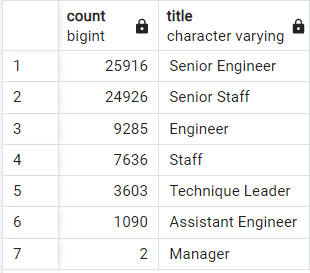
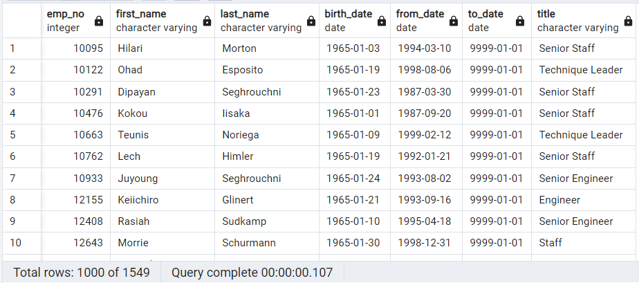

# Pewlett-Hackard-Analysis

## **Overview**
---

### Purpose
Provide an anlysis on data compiled using SQL to help Pewlett-Hackard prepare for a “silver tsunami” as many current employees reach retirement age. This will be achieved by completing the following deliverables:
- Deliverable 1: The Number of Retiring Employees by Title
- Deliverable 2: The Employees Eligible for the Mentorship Program
- Deliverable 3: A written report on the employee database analysis (README.md)

## **Results**
---

### Major Points
1. Engineering employees are the largest group that will be retiring.
2. Over 50% of the employees retirng have a senior job title.
3. 1,549 out of 72,458 retiring employees will be eligible to participate in a mentorship program.
4. Very few managers are retiring. 

 
 

    

Figure 1

 

 
 

    

Figure 2

 

## **Summary**
---
### Questions
Q. How many roles will need to be filled as the "silver tsunami" begins to make an impact?
 
A. 72,458 roles will need to be filled.

 
Q. Are there enough qualified, retirement-ready employees in the departments to mentor the next generation of Pewlett Hackard employees?
 
A. There are not enough mentorship ready employees to mentor the next generation. Assuming all elegible mentorship retirees participated in the program the ratio of mentors to new employees would be approximately 1:47 which is an inadequate ratio.

 

### Suggestions
Additional queries or tables that may provide more insight:
- A table showing the count of employees by title for employees eligilbe for the mentorship program. This could better determine what job roles are further lacking in mentors.
- A table breaking down the amount of employees retiring by deparment. This will help determine what department will require further support.
- A table showing the count of still hired employees (not retiring) by title to identify if there are enough qualified and hired employees to help mentor new employees.

